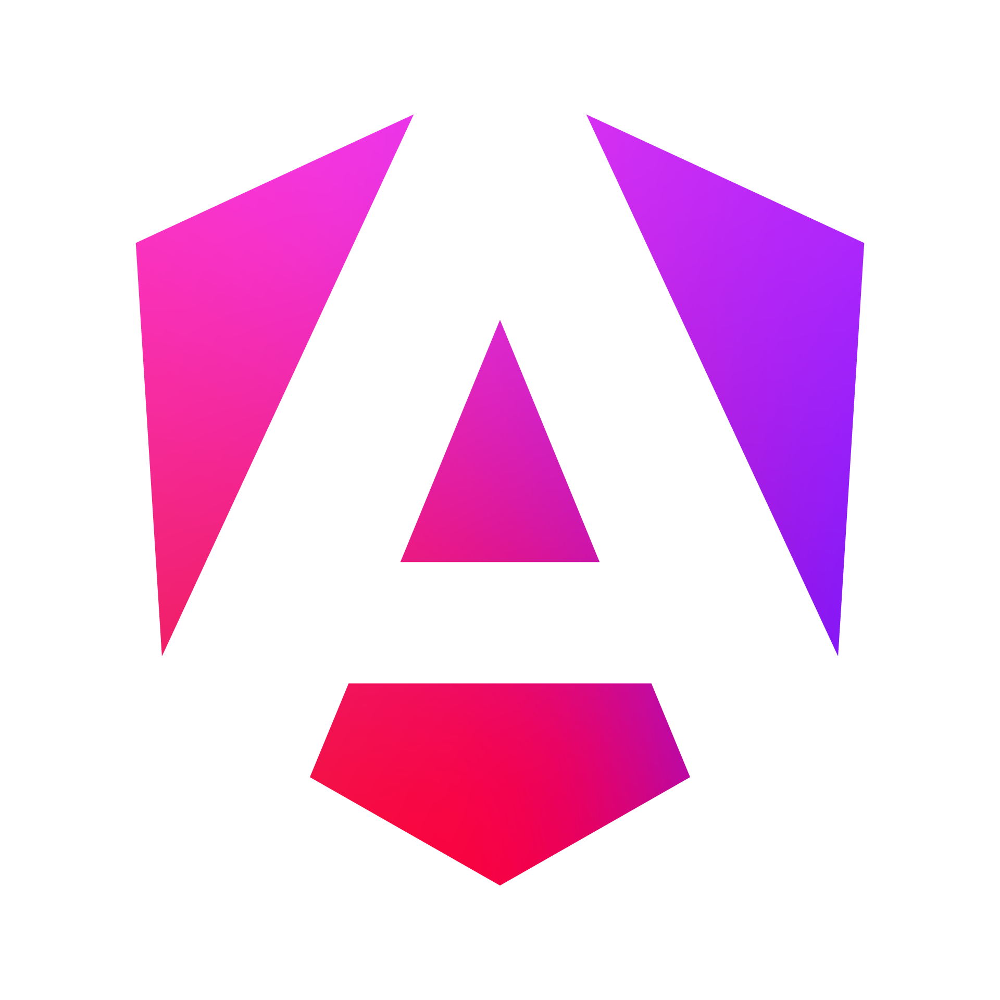

<p align="center">
  
</p>

# NgConsole (Micro-Frontends Monorepo)

NgConsole is an enterprise-grade micro-frontend platform built with **Angular v20+**, **Nx**, and **Native Federation** (`@angular-architects/native-federation`). It serves as the administrative interface for the Cloud Console ecosystem.

**Backend API:** [ng-console-api](https://github.com/SergeyDziadevich/ng-console-api/)

---

## Architecture Overview

NgConsole uses a modular Nx monorepo architecture with a host shell and dynamic remote micro-frontends powered by ESM Native Federation:

```
ng-console/
├── apps/
│   ├── shell/                # Host Shell application (port 4200) - dynamic remote loader & layout
│   ├── users-mfe/            # User Management Remote (port 4201)
│   ├── tickets-mfe/          # Support Ticketing Remote (port 4202)
│   ├── documents-mfe/        # Documents, RAG & Digital Signatures Remote (port 4203)
│   ├── payments-mfe/         # Stripe Subscriptions & Billing Remote (port 4204)
│   ├── chat-mfe/             # Real-Time Chat & Messaging Remote (port 4205)
│   └── ai-assistant-mfe/     # GenAI Assistant Remote (port 4206)
├── libs/
│   └── shared/
│       ├── models/           # Shared TypeScript models and interfaces
│       ├── data-access/      # Shared API services, HTTP interceptors, and state
│       ├── ui/               # Reusable presentation components (modals, toasts, icons)
│       ├── layout/           # Header, sidebar, command palette, and trial banner
│       └── util/             # Guards, directives, pipes, and utility functions
└── k8s/                      # Kubernetes manifests and Kustomize overlays
```

---

## Key Features

- **Micro-Frontend Architecture**: Host Shell with independent remote micro-frontends loaded on-demand via browser-native ESM federation without Webpack bundling overhead.
- **Modern Angular v20+**: 100% `ChangeDetectionStrategy.OnPush`, signal-based state (`signal()`, `computed()`, `input()`, `output()`), and native control flow (`@if`, `@for`, `@switch`).
- **Authentication & RBAC**: JWT and Google OAuth2 authentication with role-based access control and route guards.
- **AI Assistant**: Intelligent assistant powered by Firebase Genkit with document Retrieval-Augmented Generation (RAG) and tool calling.
- **Document Hub & E-Signatures**: Upload, PDF document generation, digital signatures, public share links, and Google Drive auto-sync.
- **Billing & Subscriptions**: Stripe checkout integration, subscription tier management, and billing portal access.
- **Real-Time Communications**: Live chat and notification delivery over WebSockets.
- **Internationalization (i18n)**: Reactive multi-language switching (`en`, `es`, `de`, `fr`).
- **Comprehensive Quality Gates**: 100% strict TypeScript (zero `any`), Vitest unit tests, and multi-tier Playwright E2E suites.

---

## Getting Started

### Prerequisites

- **Node.js**: `v20.x` or `v22.x`
- **npm**: `v10.x` or higher

### Installation

```bash
# Install dependencies
npm install
```

### Running Locally

```bash
# Start the Host Shell (http://localhost:4200)
npx nx serve shell

# Start all micro-frontend applications simultaneously
npm run start:all
```

---

## Workspace Commands

| Command | Description |
|---|---|
| `npx nx serve shell` | Run the Host Shell application |
| `npx nx serve <mfe-name>` | Run a specific remote micro-frontend (e.g., `users-mfe`) |
| `npx nx run-many -t build` | Build all applications and shared libraries |
| `npx nx run-many -t test` | Run unit tests across all workspace projects via Vitest |
| `npx nx run-many -t lint` | Run ESLint across all projects |
| `npx playwright test` | Execute the Playwright end-to-end test suite |
| `npm run e2e:harness` | Run the unified multi-tier test harness |

---

## Containerization & Kubernetes Deployment

Multi-stage production Dockerfiles and Kustomize overlays are available under `k8s/`:

```bash
# Build Docker image
docker build -f Dockerfile.frontend -t ng-console-frontend:latest .

# Validate Kubernetes manifests
./scripts/validate-k8s.sh

# Apply Kubernetes Kustomize overlay (local / staging)
kubectl apply -k k8s/overlays/local
```

---

## License

This project is licensed under the [MIT License](LICENSE).

